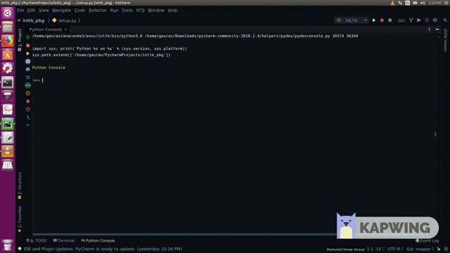

## Natural Language Toolkit for Indic Languages (iNLTK)

[](https://gitter.im/inltk/community?utm_source=badge&utm_medium=badge&utm_campaign=pr-badge)

iNLTK aims to provide out of the box support for various NLP tasks 
that an application developer might need for Indic languages.



### Installation

```bash
pip install http://download.pytorch.org/whl/cpu/torch-1.0.0-cp36-cp36m-linux_x86_64.whl
pip install inltk
```

iNLTK runs on CPU, as is the desired behaviour for most
of the Deep Learning models in production.

The first command above will install pytorch-cpu, which, as the name suggests,
 does not have cuda support. 
 
`Note: inltk is currently supported only on Linux with Python >= 3.6`
 

### Supported languages

| Language | Code <code-of-language> |
|:--------:|:----:|
|   Hindi  |  hi  |
|  Punjabi |  pa  |
| Sanskrit |  sa  |
| Gujarati |  gu  |
|  Kannada |  kn  |
| Malyalam |  ml  |
|  Nepali  |  ne  |
|   Odia   |  or  |
|  Marathi |  mr  |
|  Bengali |  bn  |
|   Tamil  |  ta  |

### Usage

**Setup the language**

```bash
from inltk.inltk import setup

setup('<code-of-language>') // if you wanted to use hindi, then setup('hi')
```

`Note: You need to run setup('<code-of-language>') when you use a language 
for the FIRST TIME ONLY. This will download all the necessary models required
to do inference for that language.`

**Tokenize**

```bash
from inltk.inltk import tokenize

tokenize(text ,'<code-of-language>') // where text is string in <code-of-language>
```

**Predict Next 'n' words**

```bash
from inltk.inltk import predict_next_words

predict_next_words(text , n, '<code-of-language>') 

// text --> string in <code-of-language>
// n --> number of words you want to predict (integer)
```

`Note: You can also pass a fourth parameter, randomness, to predict_next_words.
It has a default value of 0.8`

**Identify language**

Note: If you update the version of iNLTK, you need to run 
`reset_language_identifying_models` before identifying language.

```bash
from inltk.inltk import identify_language, reset_language_identifying_models

reset_language_identifying_models() # only if you've updated iNLTK version
identify_language(text)

// text --> string in one of the supported languages

Example:

>> identify_language('न्यायदर्शनम् भारतीयदर्शनेषु अन्यतमम्। वैदिकदर्शनेषु ')
'sanskrit'

```

**Remove foreign languages**

```bash
from inltk.inltk import remove_foreign_languages

remove_foreign_languages(text, '<code-of-language>')

// text --> string in one of the supported languages
// <code-of-language> --> code of that language whose words you want to retain

Example:

>> remove_foreign_languages('विकिपीडिया सभी विषयों ਇੱਕ ਅਲੌਕਿਕ ਨਜ਼ਾਰਾ ਬੱਝਾ ਹੋਇਆ ਸਾਹਮਣੇ ਆ ਖਲੋਂਦਾ ਸੀ पर प्रामाणिक और 维基百科:关于中文维基百科 उपयोग, परिवर्तन 维基百科:关于中文维基百科', 'hi')
['▁विकिपीडिया', '▁सभी', '▁विषयों', '▁', '<unk>', '▁', '<unk>', '▁', '<unk>', '▁', '<unk>', '▁', '<unk>', '▁', '<unk>', '▁', '<unk>', '▁', '<unk>', '▁', '<unk>', '▁पर', '▁प्रामाणिक', '▁और', '▁', '<unk>', ':', '<unk>', '▁उपयोग', ',', '▁परिवर्तन', '▁', '<unk>', ':', '<unk>']
```

Every word other than that of host language will become `<unk>` and `▁` signifies `space character`

Checkout [this notebook](https://drive.google.com/file/d/0B3K0rqnCfC9pbVpSWk9Ndm5raGRCdjV6cGxVN1BGWFhTTlA0/view?usp=sharing)
 by [Amol Mahajan](https://www.linkedin.com/in/amolmahajan0804/) where he uses iNLTK to remove foreign characters from
 [iitb_en_hi_parallel corpus](http://www.cfilt.iitb.ac.in/iitb_parallel/iitb_corpus_download/)

#### Repositories containing models used in iNLTK

| Language | Repository                                                      | Perplexity of Language model | Wikipedia Articles Dataset |   Classification accuracy   |     Classification Kappa score    |
|:--------:|-----------------------------------------------------------------|:----------------------------:|:--------------------------:|:---------------------------:|:---------------------------------:|
|   Hindi  | [NLP for Hindi](https://github.com/goru001/nlp-for-hindi)       |              ~36             |       55,000 articles      |  ~79 (News Classification)  | ~30 (Movie Review Classification) |
|  Punjabi | [NLP for Punjabi](https://github.com/goru001/nlp-for-punjabi)   |              ~13             |       44,000 articles      | ~89 (News Classification)   |     ~60 (News Classification)     |
| Sanskrit | [NLP for Sanskrit](https://github.com/goru001/nlp-for-sanskrit) |              ~6              |       22,273 articles      | ~70 (Shloka Classification) |    ~56 (Shloka Classification)    |
| Gujarati | [NLP for Gujarati](https://github.com/goru001/nlp-for-gujarati) |              ~34             |       31,913 articles      |  ~91 (News Classification)  |     ~85 (News Classification)     |
|  Kannada | [NLP for Kannada](https://github.com/goru001/nlp-for-kannada)   |              ~70             |       32,997 articles      |  ~94 (News Classification)  |     ~90 (News Classification)     |
| Malyalam | [NLP for Malyalam](https://github.com/goru001/nlp-for-malyalam) |              ~26             |       12,388 articles      |  ~94 (News Classification)  |     ~91 (News Classification)     |
|  Nepali  | [NLP for Nepali](https://github.com/goru001/nlp-for-nepali)     |              ~32             |       38,757 articles      |  ~97 (News Classification)  |     ~96 (News Classification)     |
|   Odia   | [NLP for Odia](https://github.com/goru001/nlp-for-odia)         |              ~27             |       17,781 articles      |  ~95 (News Classification)  |     ~92 (News Classification)     |
|  Marathi | [NLP for Marathi](https://github.com/goru001/nlp-for-marathi)   |              ~18             |       85,537 articles      |  ~91 (News Classification)  |     ~84 (News Classification)     |
|  Bengali | [NLP for Bengali](https://github.com/goru001/nlp-for-bengali)   |              ~41             |       72,374 articles      |  ~94 (News Classification)  |     ~92 (News Classification)     |
|   Tamil  | [NLP for Tamil](https://github.com/goru001/nlp-for-tamil)       |              ~20             |       >127,000 articles    |  ~97 (News Classification)  |     ~95 (News Classification)     |

### Contributing

**Add a new language support for iNLTK**

If you would like to add support for language of your own choice to iNLTK,
 please start with checking/raising a issue [here](https://github.com/goru001/inltk/issues)
 
Please checkout the steps I'd [mentioned here for Telugu](https://github.com/goru001/inltk/issues/1)
to begin with. They should be almost similar for other languages as well.

**Improving models/Using models for your own research**

If you would like to take iNLTK's models and refine them with your own 
dataset or build your own custom models on top of it, please check out the 
repositories in the above table for the language of your choice. The repositories above 
contain links to datasets, pretrained models, classifiers and all of the code for that.

**Add new functionality**

If you wish for a particular functionality in iNLTK - Start by checking/raising a issue [here](https://github.com/goru001/inltk/issues)

### What's next (and being worked upon)

`Shout out if you want to help :)`

* Add [Tamil](https://github.com/goru001/inltk/issues/2) and [Telugu](https://github.com/goru001/inltk/issues/1) support
* Add function to get_embeddings_for_words, get_embeddings_for_sentences
* Add NER for all the languages
* Add translations - to and from languages in iNLTK + English
* Work on a unified model for all the languages


### What's next - (and NOT being worked upon)

`Shout out if you want to lead :)`

* Add Windows support

### Appreciation for iNLTK 

* [By Jeremy Howard on Twitter](https://twitter.com/jeremyphoward/status/1111318198891110402)
* [By Vincent Boucher on LinkedIn](https://www.linkedin.com/feed/update/urn:li:activity:6517137647310241792/)
* [By Kanimozhi](https://www.linkedin.com/feed/update/urn:li:activity:6517277916030701568), [By Soham](https://www.linkedin.com/feed/update/urn:li:activity:6513084638955696128) on LinkedIn


